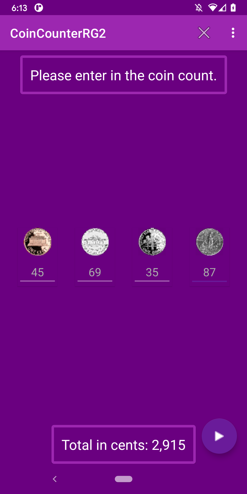

# CoinCounterRG2 Final Exam Project
##### This project was completed for Final Exam in MCON 521. Taught by Professor Samuel Abrahamson.

CoinCounter counts the number of coins entered and returns the value in cents. 

##### CoinCounter Model, SplashActivity, Util class, and drawables were provided by Professor Samuel Abrahamson.